#  Olist E-Commerce SQL Analysis

## Project Overview

This project analyzes Olist, a Brazilian e-commerce marketplace, using SQL to extract business insights from 4 relational datasets covering orders, products, payments, and customers.

> Dataset: 99,441 orders · 26 Brazilian states · Sep 2016 – Aug 2018

---


## Section 1 — Overview KPIs

> **Business Question:** What is the overall health of the marketplace?

### 1.1 Total Orders, Revenue, Customers & Sellers

```sql
SELECT
    COUNT(DISTINCT o.order_id)          AS total_orders,
    COUNT(DISTINCT o.customer_id)       AS total_customers,
    COUNT(DISTINCT oi.seller_id)        AS total_sellers,
    COUNT(DISTINCT oi.product_id)       AS total_products,
    ROUND(SUM(oi.price), 2)             AS total_revenue,
    ROUND(SUM(oi.freight_value), 2)     AS total_freight,
    ROUND(AVG(oi.price), 2)             AS avg_product_price,
    ROUND(AVG(oi.freight_value), 2)     AS avg_freight_value
FROM orders o
JOIN order_items oi ON o.order_id = oi.order_id
WHERE o.order_status = 'delivered';
```


**Result:**


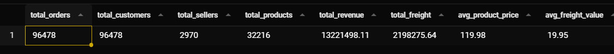

The equal total_orders and total_customers indicates that almost all customers have only placed one order.

---

### 1.2 Order Status Breakdown

```sql
SELECT
    order_status,
    COUNT(*)                                            AS order_count,
    ROUND(COUNT(*) * 100.0 / SUM(COUNT(*)) OVER(), 2)  AS pct_of_total
FROM orders
GROUP BY order_status
ORDER BY order_count DESC;
```

**Result:**


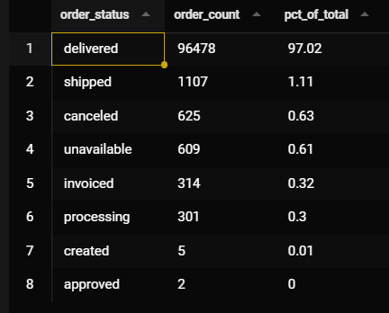


---

## Section 2 — Sales Trend Analysis

> **Business Question:** How is the business growing month over month?

### 2.1 Monthly Revenue & MoM Growth

```sql
SELECT
    strftime('%Y-%m', o.order_purchase_timestamp) AS month,
    COUNT(DISTINCT o.order_id)                     AS total_orders,
    ROUND(SUM(oi.price), 2)                        AS monthly_revenue,
    ROUND(AVG(oi.price), 2)                        AS avg_order_value
FROM orders o
JOIN order_items oi ON o.order_id = oi.order_id
WHERE o.order_status = 'delivered'
GROUP BY strftime('%Y-%m', o.order_purchase_timestamp)
ORDER BY month;
```

**Result:**

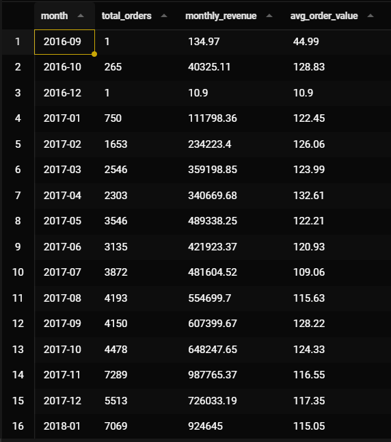
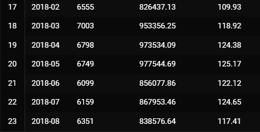


---

### 2.2 Day of Week Purchasing Pattern

```sql
SELECT
    CASE strftime('%w', order_purchase_timestamp)
        WHEN '0' THEN 'Sunday'
        WHEN '1' THEN 'Monday'
        WHEN '2' THEN 'Tuesday'
        WHEN '3' THEN 'Wednesday'
        WHEN '4' THEN 'Thursday'
        WHEN '5' THEN 'Friday'
        WHEN '6' THEN 'Saturday'
    END                                          AS day_of_week,
    strftime('%w', order_purchase_timestamp)     AS dow_num,
    COUNT(*)                                     AS total_orders,
    ROUND(COUNT(*) * 100.0
          / (SELECT COUNT(*) FROM orders), 2)   AS pct
FROM orders
GROUP BY strftime('%w', order_purchase_timestamp)
ORDER BY dow_num;
```

**Result:**

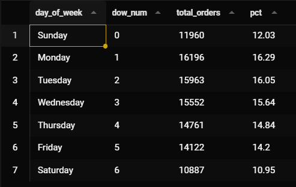


This shows that there are more orders on weekdays than on weekends.

---

### 2.3 Hourly Purchase Distribution

```sql
SELECT
    strftime('%H', order_purchase_timestamp) AS hour_of_day,
    COUNT(*)                                  AS total_orders
FROM orders
GROUP BY strftime('%H', order_purchase_timestamp)
ORDER BY hour_of_day;
```

**Result:**

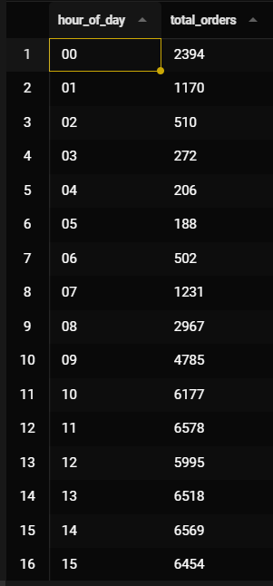
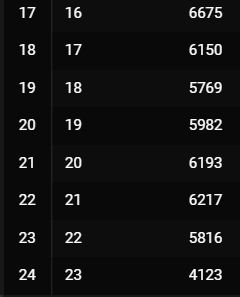


Orders start surging from 10 AM to 5 PM, which is the peak period, then gradually decrease. This is the best time to run a flash sale or send notifications.

---

## Section 3 — Customer Analysis

> **Business Question:** Who are our customers and where are they?

### 3.1 Customer Distribution by State

```sql
SELECT
    c.customer_state,
    COUNT(DISTINCT c.customer_unique_id)                AS unique_customers,
    COUNT(DISTINCT o.order_id)                          AS total_orders,
    ROUND(SUM(oi.price), 2)                             AS total_revenue,
    ROUND(COUNT(DISTINCT o.order_id) * 100.0
          / (SELECT COUNT(*) FROM orders
             WHERE order_status = 'delivered'), 2)      AS pct_of_orders
FROM customers c
JOIN orders o      ON c.customer_id = o.customer_id
JOIN order_items oi ON o.order_id   = oi.order_id
WHERE o.order_status = 'delivered'
GROUP BY c.customer_state
ORDER BY total_orders DESC
LIMIT 10;


```

**Result:**

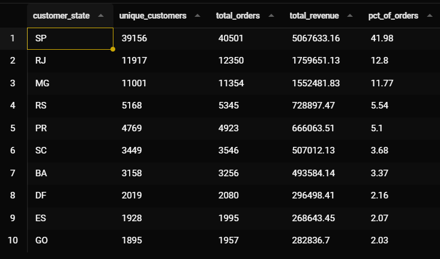

The state of SP alone accounts for almost 42% of all orders. The combined total of the top three states (SP + RJ + MG) reaches 69%, indicating that the market is primarily concentrated in southeastern Brazil.

---

### 3.2 Customer Repeat Purchase Rate

```sql
WITH customer_orders AS (
    SELECT
        c.customer_unique_id,
        COUNT(o.order_id) AS order_count
    FROM customers c
    JOIN orders o ON c.customer_id = o.customer_id
    GROUP BY c.customer_unique_id
)
SELECT
    order_count,
    COUNT(customer_unique_id)  AS num_customers,
    ROUND(COUNT(customer_unique_id) * 100.0
          / (SELECT COUNT(*) FROM customer_orders), 2) AS pct_of_customers
FROM customer_orders
GROUP BY order_count
ORDER BY order_count;
```

**Result:**

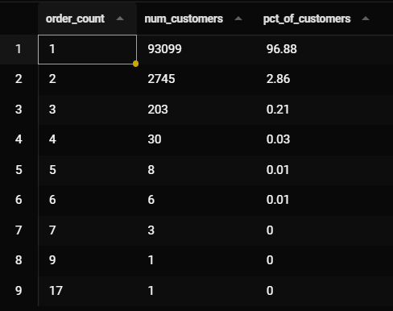


Over 96% of customers make only one purchase and then disappear. This is a sign that the business relies too heavily on acquiring new customers. If you can implement a loyalty program or email remarketing to bring back old customers, you can significantly increase your revenue. 


---


## Section 4 — Delivery Performance

> **Business Question:** Are we delivering on time? Where do we fail?

### 4.1 Overall Delivery Time Stats

```sql
SELECT
    ROUND(AVG(julianday(order_delivered_customer_date)
              - julianday(order_purchase_timestamp)), 1)   AS avg_delivery_days,
    ROUND(MIN(julianday(order_delivered_customer_date)
              - julianday(order_purchase_timestamp)), 1)   AS min_delivery_days,
    ROUND(MAX(julianday(order_delivered_customer_date)
              - julianday(order_purchase_timestamp)), 1)   AS max_delivery_days,
    COUNT(CASE WHEN order_delivered_customer_date
                    > order_estimated_delivery_date
               THEN 1 END)                                 AS late_deliveries,
    COUNT(*)                                               AS total_delivered,
    ROUND(COUNT(CASE WHEN order_delivered_customer_date
                          > order_estimated_delivery_date
                     THEN 1 END) * 100.0 / COUNT(*), 2)   AS late_delivery_pct
FROM orders
WHERE order_status = 'delivered'
  AND order_delivered_customer_date IS NOT NULL
  AND order_purchase_timestamp IS NOT NULL;
```

**Result:**

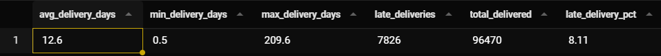


Fastest delivery: 0 days — Likely an item that can be received immediately.
Slowest delivery: 209 days — Almost 7 months. This figure needs improvement.
7,826 orders were delivered later than scheduled, representing 8.1%, a figure that needs improvement.

---

### 4.2 On-time vs Late Delivery by State

```sql
SELECT
    c.customer_state,
    COUNT(*)                                                       AS total_deliveries,
    COUNT(CASE WHEN o.order_delivered_customer_date
                    <= o.order_estimated_delivery_date THEN 1 END) AS on_time,
    COUNT(CASE WHEN o.order_delivered_customer_date
                    > o.order_estimated_delivery_date THEN 1 END)  AS late,
    ROUND(COUNT(CASE WHEN o.order_delivered_customer_date
                          > o.order_estimated_delivery_date
                     THEN 1 END) * 100.0 / COUNT(*), 2)           AS late_pct,
    ROUND(AVG(julianday(o.order_delivered_customer_date)
              - julianday(o.order_purchase_timestamp)), 1)         AS avg_delivery_days
FROM orders o
JOIN customers c ON o.customer_id = c.customer_id
WHERE o.order_status = 'delivered'
  AND o.order_delivered_customer_date IS NOT NULL
GROUP BY c.customer_state
ORDER BY late_pct DESC
LIMIT 10;
```

**Result:**

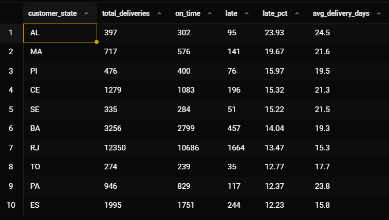


The states with the slowest delivery times are all in northeastern Brazil, such as AL, MA, and PI, which are far from the infrastructure. Notice that the average delivery days are also high, indicating that the main problem is distance, not process delays.

---


## Section 5 — Payment Analysis

> **Business Question:** How do customers pay, and what are the patterns?

### 5.1 Payment Method Distribution

```sql
SELECT
    payment_type,
    COUNT(DISTINCT order_id)                              AS total_orders,
    ROUND(SUM(payment_value), 2)                         AS total_value,
    ROUND(AVG(payment_value), 2)                         AS avg_payment_value,
    ROUND(COUNT(DISTINCT order_id) * 100.0
          / (SELECT COUNT(DISTINCT order_id)
             FROM order_payments), 2)                    AS pct_of_orders
FROM order_payments
GROUP BY payment_type
ORDER BY total_orders DESC;
```

**Result:**

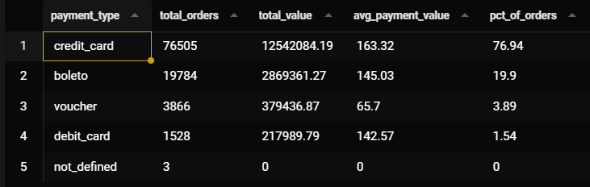


---

### 5.2 Credit Card Installment Distribution

```sql
SELECT
    payment_installments,
    COUNT(*)                                              AS num_transactions,
    ROUND(SUM(payment_value), 2)                         AS total_value,
    ROUND(COUNT(*) * 100.0
          / (SELECT COUNT(*) FROM order_payments
             WHERE payment_type = 'credit_card'), 2)     AS pct
FROM order_payments
WHERE payment_type = 'credit_card'
GROUP BY payment_installments
ORDER BY payment_installments;
```

**Result:**


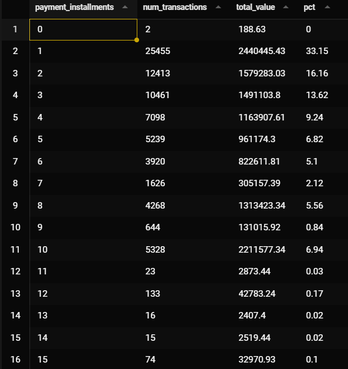
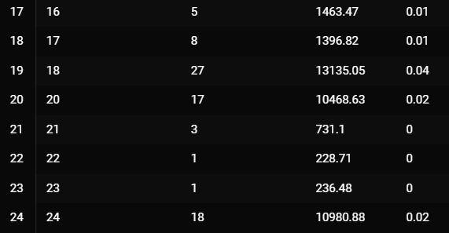


1 installment (50.5%) — Half of the customers pay in full, indicating they have purchasing power or the product is not very expensive.
2-3 installments combined (21.9%) — This group chooses short installment plans, usually for mid-priced products.
10 installments (5.1%) — This is the longest installment plan chosen by customers, likely for high-priced products.

---


## Section 6 — Seller Performance

> **Business Question:** Which sellers drive the most value?

### 6.1 Top 10 Sellers by Revenue

```sql
SELECT
    oi.seller_id,
    COUNT(DISTINCT oi.order_id)     AS total_orders,
    COUNT(oi.order_item_id)         AS total_items_sold,
    ROUND(SUM(oi.price), 2)         AS total_revenue,
    ROUND(AVG(oi.price), 2)         AS avg_item_price,
    ROUND(SUM(oi.freight_value), 2) AS total_freight_charged
FROM order_items oi
JOIN orders o ON oi.order_id = o.order_id
WHERE o.order_status = 'delivered'
GROUP BY oi.seller_id
ORDER BY total_revenue DESC
LIMIT 10;
```

**Result:**

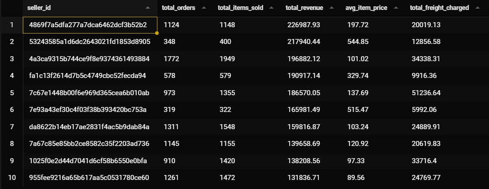


---


## Section 7 — Advanced Analytics

> **Business Question:** Cohort retention, running totals, and ranking.

### 7.1 Running Total Revenue by Month

```sql
SELECT
    month,
    monthly_revenue,
    SUM(monthly_revenue) OVER (
        ORDER BY month
        ROWS BETWEEN UNBOUNDED PRECEDING AND CURRENT ROW
    ) AS running_total_revenue
FROM (
    SELECT
        strftime('%Y-%m', o.order_purchase_timestamp) AS month,
        ROUND(SUM(oi.price), 2)                        AS monthly_revenue
    FROM orders o
    JOIN order_items oi ON o.order_id = oi.order_id
    WHERE o.order_status = 'delivered'
    GROUP BY strftime('%Y-%m', o.order_purchase_timestamp)
) monthly
ORDER BY month;
```

**Result:**

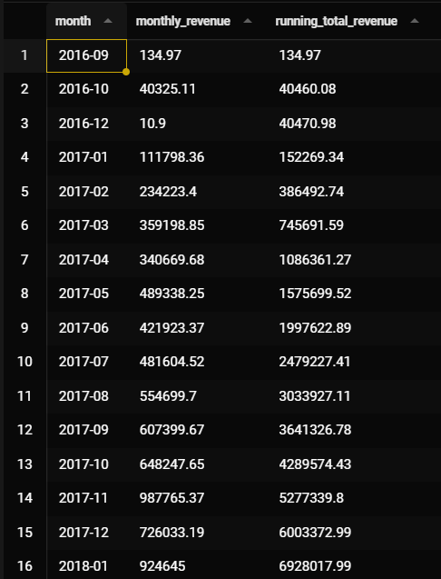
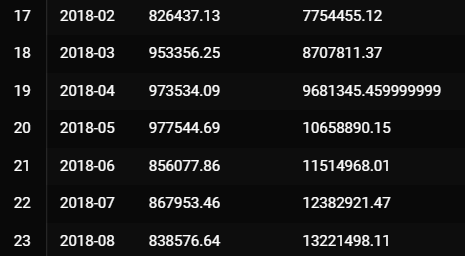


It gives a clearer picture of the growth rate than just looking at monthly figures.


---

### 7.2  Month-over-Month Revenue Growth

```sql
SELECT
    month,
    monthly_revenue,
    prev_revenue,
    CASE
        WHEN prev_revenue IS NULL THEN NULL
        ELSE ROUND((monthly_revenue - prev_revenue) / prev_revenue * 100, 2)
    END AS mom_growth_pct
FROM (
    SELECT
        strftime('%Y-%m', o.order_purchase_timestamp) AS month,
        ROUND(SUM(oi.price), 2)                        AS monthly_revenue,
        LAG(ROUND(SUM(oi.price), 2)) OVER (
            ORDER BY strftime('%Y-%m', o.order_purchase_timestamp)
        )                                              AS prev_revenue
    FROM orders o
    JOIN order_items oi ON o.order_id = oi.order_id
    WHERE o.order_status = 'delivered'
    GROUP BY strftime('%Y-%m', o.order_purchase_timestamp)
) t
ORDER BY month;
```

**Result:**

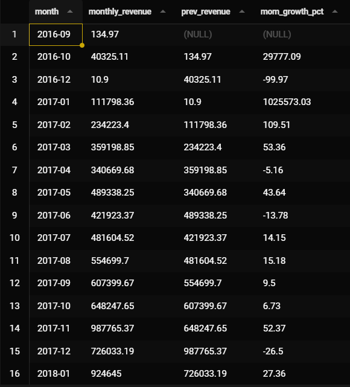
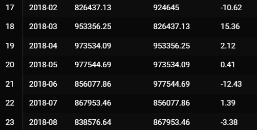


Nov 2017 +52% — Black Friday caused an unusually high surge in sales.
Dec 2017 -26% — After Black Friday, sales returned to normal levels; this is not a bad sign.


---

